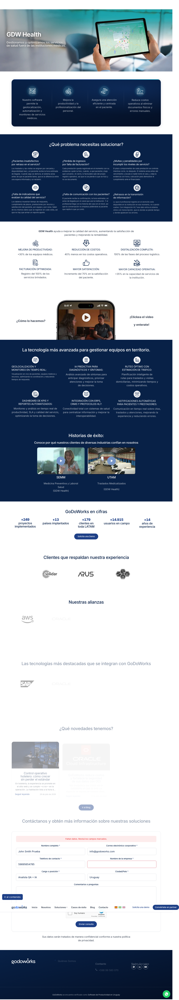

# Reporte de incidencia — Solicitud de demo GDW Health

## Título
El mensaje de error de validación no indica el nombre del campo obligatorio faltante, y depende únicamente del color para señalarlo.

## Entorno
- Navegador: Chrome (última versión)
- URL: https://www.godoworks.com/soluciones/ → GDW Health → Solicitar una demostración

## Severidad
Menor / Usabilidad y Accesibilidad

## Prioridad
Media

## Pasos para reproducir
1. Ir a https://www.godoworks.com/soluciones/
2. Clic en GDW Health
3. Clic en "Solicitar una demostración"
4. Completar el formulario dejando "Nombre de la empresa" vacío (resto de los campos completos)
5. Clic en "Enviar consulta"

## Resultado esperado
Ante un campo obligatorio faltante, el sistema debería indicarlo con al menos dos señales distintas (por ejemplo, color + texto de ayuda o ícono junto al campo, y/o mencionarlo por nombre en el mensaje general), para que no dependa únicamente de la percepción del color.

## Resultado actual
El campo "Nombre de la empresa" se resalta con un borde rojo, pero no incluye ningún texto o ícono adicional junto al campo, y el mensaje general "Faltan datos. Revisá los campos marcados" tampoco menciona el nombre del campo. Un usuario con dificultad para distinguir colores no tendría forma de identificar cuál es el campo faltante.

## Sugerencia
Agregar un mensaje corto debajo del campo (ej. "Este campo es obligatorio") además del borde en color, y/o mencionar el campo por nombre en el mensaje general.

## Evidencia

Ver también el test automatizado que reproduce el flujo completo (pasos 1-7):
[`e2e/tests/solicitud-demo-gdw-health.spec.ts`](../e2e/tests/solicitud-demo-gdw-health.spec.ts)
